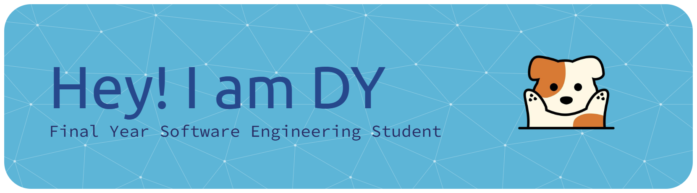

# Introduction

Hi! I'm DY, a student in the Software Maintenance and Evolution course.

I like building things people actually use, and making them look good while I'm at it. I've done a bit of everything: web, mobile, games, and pitch deck.

- **Fun fact**: I built a desktop pet of my doggy that types along with me whenever I type.
- **Course expectations**: To learn how to keep software clean and reliable as it grows, not just get it working once.
 

## 🛠️ What I've been building

- **Chemical inventory system** (FYP): web app for tracking lab chemicals and safety, with role-based access. Next.js, Tailwind, Supabase.
- **Recycling gamification platform** (in progress): web app that turns school recycling into a game, with points and class leaderboards. React + TypeScript (Vite), NestJS + TypeORM API.
- **Savora**: financial planning web platform with goal-based planning and investment tools. I built the AI Financial Assistant chatbot and the login/registration system. Express.js + MongoDB.
- **typing-dudu**: Electron desktop pet, Bongo Cat style, starring my doggy.
 

## 🧰 Tech I use

**Languages**

**Frontend**

**Backend**

**Database**

**Desktop & Mobile**

**Tools & Design**

 

## 📊 GitHub stats

<!--
**DYing04/DYing04** is a ✨ _special_ ✨ repository because its `README.md` (this file) appears on your GitHub profile.

Here are some ideas to get you started:

- 🔭 I’m currently working on ...
- 🌱 I’m currently learning ...
- 👯 I’m looking to collaborate on ...
- 🤔 I’m looking for help with ...
- 💬 Ask me about ...
- 📫 How to reach me: ...
- 😄 Pronouns: ...
- ⚡ Fun fact: ...
-->
